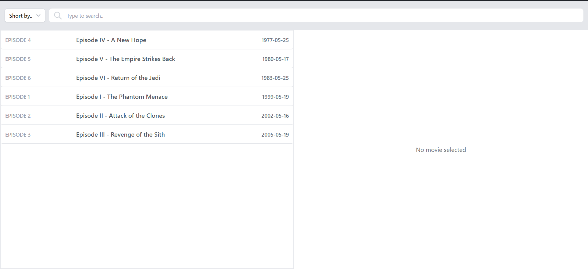
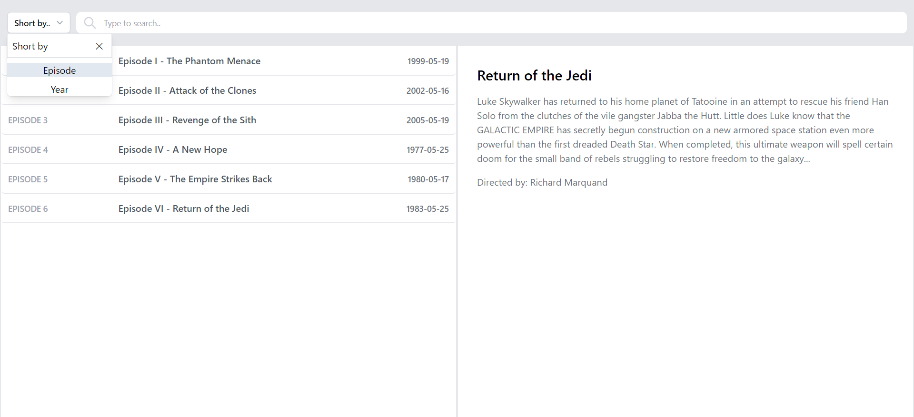
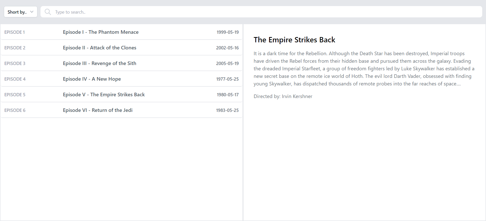
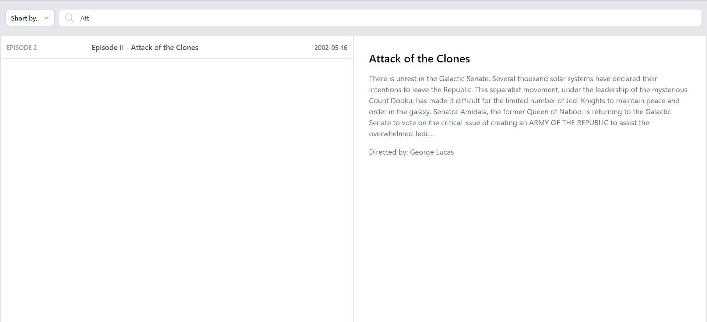

# Front-end assignment

For this assignment, I created a web app for listing Star Wars movies. The data fetched from the following endpoint: https://swapi.dev/api/films/?format=json.

## Description

When the app is loaded, a list of the movies is displayed, as the image below shows: 

There be a way to order the movies by `Year` or `Episode` as the select menu shows in the image below:

When clicking on a movie in the list, a detailed view of it is displayed on the right-hand side of the application. In this case, ”Episode V: The Empire Strikes Back” is chosen (when no movie is selected, a default text should be displayed instead):

Additionally, there is a way to filter the movies by entering their name in the text input:

**The images above are the actual design of the web app.**.

## Tooling

- I have used React Redux and Redux Toolkit for the data flow inside the web app.
- Used tailwind CSS for the styling of the page.
- Used axios for the data fetching from the given API endpoint.

## Thank you

Thanks for this opportunity to showcase my skills. I look forward to getting your response.

